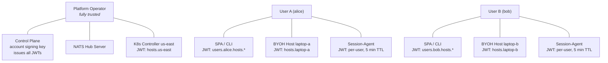

# ADR: NATS JetStream Permission Tightening

**Status**: draft
**Status history**:
- 2026-04-29: draft

## Overview
Tighten NATS JetStream permissions for all identity types (user, session-agent, host) from broad wildcards (`$JS.API.>`, `$JS.*.API.>`) to explicit, scoped allow-lists. This is a prerequisite for ADR-0053 (Session Import), which introduces per-user Object Store buckets that require user-scoped JetStream access.

## Motivation
The current NATS permission model grants every identity type broad JetStream API access:

| Identity | Current permission | What it allows |
|----------|-------------------|----------------|
| User (SPA/CLI) | `$JS.API.>` pub+sub | ALL JetStream operations on ALL streams, KV buckets, and Object Store buckets |
| Session-agent | `$JS.API.>`, `$JS.*.API.>`, unscoped `$KV.mclaude-sessions.>` etc. | ALL JetStream ops + access to ALL users' KV entries |
| Host | `$JS.*.API.>` | ALL domain-prefixed JetStream operations |

**Consequences:**
- A compromised user JWT can read/write/delete any other user's sessions, projects, hosts
- A rogue session-agent can access all users' data across all KV buckets
- A compromised host credential has full JetStream access across all domains
- ADR-0053's per-user Object Store buckets are meaningless if any user JWT can access any bucket

The fix: replace broad wildcards with the minimum JetStream subjects each identity type needs, scoped to their own user/host/project namespace.

## Decisions

| Decision | Choice | Rationale |
|----------|--------|-----------|
| Isolation model | Per-user JetStream resources | Hard NATS-level isolation. Separate KV buckets, sessions streams, and Object Store buckets per user. No payload-inspection gaps. NATS handles many streams at scale. |
| Approach | Replace wildcards with explicit allow-lists referencing per-user resource names | Each identity's JWT lists the exact stream/bucket names it can touch. |
| KV buckets | Per-user: `mclaude-sessions-{uslug}`, `mclaude-projects-{uslug}`, `mclaude-job-queue-{uslug}`. Shared: `mclaude-hosts` | Per-user buckets eliminate shared-bucket prefix-scoping gaps. Hosts KV is shared — host presence data (online/offline status, last seen) is stored in a single `mclaude-hosts` bucket to avoid O(N) write fan-out on `$SYS.CONNECT/DISCONNECT` events for group-bound hosts. Visibility controlled at application layer (SPA filters by group membership). Host slugs and presence status are not considered sensitive metadata. |
| Sessions stream | Per-user: `MCLAUDE_SESSIONS_{uslug}` (consolidates events, commands, lifecycle) | One stream per user captures all session activity under `mclaude.users.{uslug}.hosts.*.projects.*.sessions.>`. Consumer creation is scoped by stream name in the subject. No filter-bypass gap. |
| Object Store | Per-user: `mclaude-imports-{uslug}` (ADR-0053) | Already per-user by design. Consistent with the rest. |
| Host/controller JetStream | None — removed entirely | Hosts and controllers only use NATS subjects for provisioning. They never needed JetStream. |
| Host subject scheme | `mclaude.hosts.{hslug}.>` (supersedes ADR-0035's `mclaude.users.{uslug}.hosts.{hslug}.>` for host-side subscriptions) | Removes user prefix from host subscriptions. Group membership enforced by control-plane (which already intercepts all requests). Host JWT is constant-size regardless of group membership. User/agent/SPA subjects unchanged. |
| Session-agent scope | Per-project | Each agent runs per-project and gets a JWT scoped to that project's KV keys only. Stolen credential on a shared BYOH host exposes one project, not all of the user's data across all hosts. No credential reissuance concern — each new project spawns a new agent with its own JWT at spawn time. |
| Credential lifecycle | Short TTL + proactive refresh for all identity types | Host JWTs: 5 min TTL (frequent membership changes). Session-agent JWTs: 5 min TTL (consistent). User JWTs: keep existing ~8h TTL (SPA already refreshes every 60s; users don't change permissions as frequently). All refresh via NATS-authenticated request (connection-level JWT + NKey validation by NATS server). |
| Session-agent JWT issuance | Control-plane only (host controllers no longer hold the account key) | Hosts request agent credentials from the control-plane via NATS. CP validates group membership, project ownership, and host assignment before minting. Removes the account signing key from all host controllers — hosts can request credentials but not forge them. |
| Session-agent refresh auth | NATS-authenticated request | Agent refresh: before JWT TTL expiry, agent publishes a refresh request on `mclaude.users.{uslug}.hosts.{hslug}.projects.{pslug}.api.agents.refresh`. The request is authenticated by the agent's current NATS connection (JWT + NKey, validated by NATS server). CP validates the request (user in group, project provisioned to host), mints a new JWT with the same scope, and returns it on the reply subject. Agent updates its NATS credentials in-flight. If the JWT has already expired (agent was disconnected too long), the NATS server closes the connection — the host controller must re-request credentials from CP via `mclaude.hosts.{hslug}.api.agents.credentials`. |
| NATS topology | All agents (BYOH and K8s) connect directly to hub NATS | Leaf-node topology removed from scope. When a leaf node has a JetStream domain set, `$JS.API.>` is suppressed — clients must use `$JS.{domain}.API.*` to reach hub. This adds complexity and brittleness (host operator must configure NATS correctly). Direct hub connection is simpler, more robust, and keeps one set of permission specs. Leaf-node topology can be added later as opt-in for offline resilience if needed. |
| Migration | Self-healing via credential refresh | Deploy new permission code. On next refresh cycle (within 24h), session-agents automatically receive tightened JWTs. For immediate effect, restart agents to trigger immediate refresh. |
| Bucket lifecycle | Control-plane creates per-user buckets on user registration; shared `mclaude-hosts` bucket created on deployment | Per-user buckets are provisioned once per user. The shared `mclaude-hosts` bucket is created once on deployment. If a bucket is missing at runtime, the control-plane creates it on demand. |
| Host binding model | Every host is bound to a group; groups have members | Unifies single-user BYOH, team BYOH, and platform hosts. Platform host = "everyone" group. No separate code paths. |
| Group nesting | Flat groups in v1; nesting is additive later | Schema uses `group_members(group_id, member_id, member_type)` from day one so nesting is a resolver change, not a reorganization. |
| Group membership revocation | Revoke + on-demand refresh signal | On membership change, old host JWT is revoked (NATS revocation list), "refresh now" pushed to host. Revocation entry auto-expires after 5 min (JWT TTL). No revocation list bloat even under high churn. |

## Threat Model

### Permission Diagrams

#### 1. Identity Hierarchy

Who owns what, and what credentials they hold.



#### 2. Proposed Permission Map

NATS data topology in the center, partitioned by user. User-side identities on left/right.
Shared platform host below, with per-user namespaces containing session-agents.

```mermaid
flowchart TB
    %% ── Left: User A's identities ──
    subgraph Left["User A (alice)"]
        SPA_A["Alice SPA / CLI"]
        subgraph BYOH_A["BYOH Host laptop-a"]
            CTRL_A["Local Controller"]
        end
    end

    %% ── Right: User B's identities ──
    subgraph Right["User B (bob)"]
        SPA_B["Bob SPA / CLI"]
        subgraph BYOH_B["BYOH Host laptop-b"]
            CTRL_B["Local Controller"]
        end
    end

    %% ── Center: NATS data topology ──
    subgraph NATS["NATS Hub — JetStream Resources"]
        subgraph Partition_A["alice's resources (separate streams/buckets)"]
            KV_A["KV: sessions-alice<br/>KV: projects-alice<br/>KV: job-queue-alice"]
            OBJ_A["Obj Store:<br/>imports-alice"]
            EVT_A["Stream:<br/>SESSIONS_alice"]
        end
        subgraph Partition_B["bob's resources (separate streams/buckets)"]
            KV_B["KV: sessions-bob<br/>KV: projects-bob<br/>KV: job-queue-bob"]
            OBJ_B["Obj Store:<br/>imports-bob"]
            EVT_B["Stream:<br/>SESSIONS_bob"]
        end
        KV_HOSTS["KV: hosts (shared)"]
    end

    %% ── Bottom: Shared platform host ──
    subgraph SharedHost["Shared Platform Host us-east (operator-managed)"]
        K8S_CTRL["K8s Controller<br/><i>JWT: hosts.us-east — no JetStream</i>"]
        subgraph NS_A["namespace: mclaude-alice"]
            AGENT_A["Session-Agent A"]
        end
        subgraph NS_B["namespace: mclaude-bob"]
            AGENT_B["Session-Agent B"]
        end
    end

    %% ── Edges: Alice SPA ──
    SPA_A -- "R: KV watch/get" --> KV_A
    SPA_A -- "R/W: upload imports" --> OBJ_A
    SPA_A -- "R: subscribe own sessions" --> EVT_A

    %% ── Edges: Bob SPA ──
    SPA_B -- "R: KV watch/get" --> KV_B
    SPA_B -- "R/W: upload imports" --> OBJ_B
    SPA_B -- "R: subscribe own sessions" --> EVT_B

    %% ── Edges: Session-Agent A (on shared host) ──
    AGENT_A -- "R/W: manage sessions,<br/>projects, jobs" --> KV_A
    AGENT_A -- "R: download imports" --> OBJ_A
    AGENT_A -- "R/W: session events,<br/>commands, lifecycle" --> EVT_A

    %% ── Edges: Session-Agent B (on shared host) ──
    AGENT_B -- "R/W: manage sessions,<br/>projects, jobs" --> KV_B
    AGENT_B -- "R: download imports" --> OBJ_B
    AGENT_B -- "R/W: session events,<br/>commands, lifecycle" --> EVT_B

    %% ── BYOH hosts: no JetStream ──
    CTRL_A -.-x|"no JetStream"| NATS
    CTRL_B -.-x|"no JetStream"| NATS

    %% ── K8s controller: no JetStream ──
    K8S_CTRL -.-x|"no JetStream"| NATS
```



**Key properties:**
- Alice's and Bob's data live in **physically separate** JetStream streams and KV buckets. No shared resources.
- Each JWT contains the user slug in every resource name -- it cannot reference another user's buckets/streams.
- Session-agents on the shared host are in separate K8s namespaces; each agent's JWT is scoped to its user's resources only.
- All host controllers (BYOH and platform) use `mclaude.hosts.{hslug}.>` — constant-size JWT regardless of group membership. Zero JetStream access.
- Group membership enforcement is in the control-plane, which already intercepts all requests.
- Users (SPA/CLI) get read-only KV, read/write Object Store, read-only sessions stream.
- Session-agents get read/write KV + sessions stream, read-only Object Store.

### Trust Tiers

| Identity | Trust level | What they control | What they should NOT access |
|----------|-------------|-------------------|---------------------------|
| **Platform operator** | Fully trusted | NATS, control-plane, platform hosts. Holds account signing key. | N/A — they own everything. |
| **User** (SPA/CLI) | Partially trusted | Their own projects, sessions, hosts. Can register BYOH hosts. | Other users' projects, sessions, hosts, imports. |
| **BYOH host** | Partially trusted | Local filesystem, local controller, session-agents. Owner = user. | Other users' NATS resources. (On their own machine they have filesystem access anyway.) |
| **Platform host controller** | Operator-trusted infrastructure | Provisioning for ALL users on that cluster. Has wildcard user scope. | JetStream resources outside its operational needs (it doesn't need KV/ObjectStore access). |
| **Session-agent** | Per-user scoped service | Sessions and projects for its assigned user. | Other users' sessions, projects, hosts, imports. |

### Attack Vectors

#### V1: Cross-User Data Access via JetStream Wildcard

**Attacker:** User A (compromised SPA, stolen JWT, or malicious user)
**Target:** User B's sessions, projects, or imports

| Attack path | Current state | Why it works |
|-------------|--------------|--------------|
| Read User B's session state | `$JS.API.DIRECT.GET.KV_mclaude-sessions` with key `{bob}.{host}.{project}.{session}` | User A's JWT has `$JS.API.>` pub+sub — allows ANY JetStream API call, including direct-get on any KV key. |
| Watch User B's session updates | Create consumer on `KV_mclaude-sessions` filtered to `{bob}.*` | `$JS.API.CONSUMER.CREATE.*` is unrestricted. |
| Read User B's project state | Same pattern on `KV_mclaude-projects` | Same wildcard. |
| Read User B's import archive | `$O.mclaude-imports-{bob}.*` | Object Store subjects go through `$JS.API.>` controlled streams. |

**Regular NATS subjects are already scoped:** User A cannot publish to `mclaude.users.{bob}.hosts.*.>` — this is correctly denied. The gap is purely in JetStream API access.

#### V2: User A Operating on a Host Not Bound to Them

**Attacker:** User A
**Target:** Host "laptop-b" (owned by User B)

| Attack path | Current state | Why it works / doesn't |
|-------------|--------------|------------------------|
| Send session-create to User B's host | Publish to `mclaude.users.{bob}.hosts.{laptop-b}.projects.{p}.api.sessions.create` | **BLOCKED.** User A's JWT only allows pub on `mclaude.users.{alice}.hosts.*.>`. Subject-level isolation works. |
| Send provisioning request to User B's host | Publish to `mclaude.users.{bob}.hosts.{laptop-b}.api.projects.create` | **BLOCKED.** Same subject scoping. |
| Inject fake project into User B's KV namespace | Write to `KV_mclaude-projects` with key `{userIdB}.{projectId}` via `$JS.API.>` | **EXPLOITABLE.** User A's `$JS.API.>` allows direct put on any KV bucket with any key. No server-side key-namespace validation. |
| Inject fake session into User B's KV namespace | Write to `KV_mclaude-sessions` with key `{bob}.{laptop-b}.{project}.{session}` | **EXPLOITABLE.** Same — KV doesn't validate writer identity against key namespace. |
| Read User B's host configuration | Direct-get on `KV_mclaude-hosts` with key `{laptop-b}` | **EXPLOITABLE.** Same JetStream wildcard. |

**Key finding:** Subject-level permissions correctly prevent User A from *commanding* User B's hosts (session create, project provision). But JetStream wildcards allow User A to *read and write* User B's state data directly in KV, bypassing all control-plane validation.

#### V3: Rogue Host Accessing Unauthorized User Data

**Attacker:** Host "laptop-a" (owned by User A — user has the NKey seed from `host register`)
**Target:** User B's data

| Attack path | Current state | Why it works |
|-------------|--------------|--------------|
| Read User B's sessions KV | `$JS.*.API.>` covers all domain-prefixed JetStream — includes `$JS.hub.API.DIRECT.GET.KV_mclaude-sessions` | Host JWT has `$JS.*.API.>` which matches any JetStream domain. |
| Read User B's projects KV | Same pattern | Same wildcard. |
| Delete User B's sessions | `$JS.*.API.STREAM.PURGE.KV_mclaude-sessions` | Stream-level operations are unrestricted. |
| Read/write any Object Store | `$JS.*.API.STREAM.INFO.OBJ_*`, `$O.*` subjects | All go through JetStream API. |

**Note:** On BYOH, the host owner IS the user, so "host accessing its own user's data" is expected. The threat is a BYOH host accessing OTHER users' data — which is currently possible via JetStream wildcards.

**Platform host controllers** have the same `$JS.*.API.>` wildcard. A compromised platform controller could read all users' data across all KV buckets. However, platform controllers are operator-managed infrastructure — the operator trusts their own controllers. The risk here is container compromise or supply-chain attacks against the controller image.

#### V4: Session-Agent Cross-User on Shared Platform Host

**Attacker:** User A's session-agent running on a shared K8s cluster
**Target:** User B's session-agent data on the same cluster

| Attack path | Current state | Why it works |
|-------------|--------------|--------------|
| Read User B's session states | Agent has `$KV.mclaude-sessions.>` (unscoped!) — subscribes to ALL session updates | The `>` wildcard matches all keys, not just the agent's user. |
| Read User B's project states | Agent has `$KV.mclaude-projects.>` (unscoped!) | Same. |
| Read User B's host config | Agent has `$KV.mclaude-hosts.>` (unscoped!) | Same. |
| Write to User B's session KV | Agent has `$KV.mclaude-sessions.>` in PubAllow | Can write fake session state under User B's key prefix. |
| Access User B's imports | Agent has `$JS.API.>` and `$JS.*.API.>` | Full JetStream access. |

**K8s provides container isolation** — agents run in separate pods in per-user namespaces. But NATS credentials are network-accessible: a compromised pod that exfiltrates its agent JWT + NKey seed has unlimited JetStream access until credential rotation. Container isolation is defense-in-depth; NATS permissions are the primary access control layer.

#### V5: KV Key Injection (Data Integrity)

This vector deserves separate treatment because it's not just a read attack — it's a write attack that can corrupt application state.

**Attacker:** Any identity with `$JS.API.>` (user, agent, or host)
**Attack:** Write a crafted KV entry to a bucket under another user's key prefix.

| Injection target | Impact |
|-----------------|--------|
| Fake session in `mclaude-sessions` under User B's prefix | User B's SPA shows a phantom session. If it references a malicious JSONL path, could trick session-agent into processing attacker-controlled data. |
| Fake project in `mclaude-projects` under User B's prefix | User B sees a project they didn't create. Provisioning could be triggered for a git URL controlled by the attacker. |
| Modified host config in `mclaude-hosts` | Could redirect provisioning requests, change host capabilities, or inject malicious configuration. |

**The control-plane and SPA trust KV entries implicitly** — they do not validate that the writer's identity matches the key's namespace prefix. KV is treated as a source of truth. This makes the JetStream wildcard gap exploitable for state manipulation, not just eavesdropping.

#### V6: Credential Theft Window

| Credential type | Current TTL | Blast radius if stolen |
|----------------|-------------|----------------------|
| User JWT (SPA) | ~8h | ALL JetStream resources for ALL users (until expiry) |
| User JWT (CLI) | Not yet implemented | Same as SPA |
| Session-agent JWT | No expiry | Permanent full JetStream access until key is revoked |
| Host JWT | No expiry | Permanent full JetStream access until key is revoked |

With tightened permissions + TTL on all credential types, the blast radius reduces to: "the compromised identity's own user namespace, for the duration of one TTL cycle."

### Isolation Boundaries Summary

| Boundary | Current enforcement | Gap | Fix |
|----------|-------------------|-----|-----|
| User A ↔ User B (NATS subjects) | Subject-level pub/sub scoping | None — correctly enforced | N/A |
| User A ↔ User B (JetStream/KV) | None (`$JS.API.>` wildcard) | Full cross-user read/write | Scope JetStream API subjects to user's own buckets |
| User A ↔ User B (Object Store) | None (Object Store uses JetStream API) | Full cross-user read/write | Per-user buckets + scoped permissions |
| Host ↔ other users (NATS subjects) | `mclaude.hosts.{hslug}.>` — group membership enforced by control-plane, not NATS subject scoping | None — correctly enforced | N/A |
| Host ↔ other users (JetStream) | Removed entirely — zero `$JS.*`, `$KV.*`, or `$O.*` subjects | None | N/A |
| Session-agent ↔ other users (KV) | Per-project scoped: `$KV.mclaude-sessions-{uslug}.{hslug}.{pslug}.>` | None — per-project scoped | N/A |
| Session-agent ↔ other users (JetStream) | None (`$JS.API.>` wildcard) | Full cross-user read/write | Scope JetStream API to user's own resources |
| Platform controller ↔ all users | By design (wildcard user for provisioning) | JetStream access broader than needed | Scope controller JetStream to provisioning operations only (it doesn't use KV/ObjectStore directly) |

### Post-Fix Residual Risks

**R1: Group membership authorization** — The group API endpoints must enforce that only the group owner (or platform operator) can modify membership. Without this, any authenticated user could add themselves to any group. This is an application-layer authorization check, not a NATS-level concern.

**R2: Control-plane compromise** — CP holds the account signing key and is the sole JWT issuer. CP compromise = all credentials compromised. CP unavailability causes cascading credential expiry (5-min TTL for hosts/agents). This is inherent to centralized credential issuance and accepted.

**R3: Membership cache staleness** — 60-second cache TTL means a removed user could obtain credentials for up to 60 seconds after removal. The explicit "refresh now" signal handles the common case; the 60s window is the fallback.

**R4: Stream info / consumer info metadata leakage** — `$JS.API.STREAM.INFO.<stream>` returns the full `StreamState` struct. NATS permissions gate which subjects an identity can *publish to* (i.e., which streams it can query), but do NOT gate the request payload content. This means options like `SubjectFilter` and `DeletedDetails` in the request body are accessible to anyone with publish permission on the stream info subject. A per-project agent credential can query the per-user stream and extract metadata about ALL of the user's projects across all hosts.

**Attacker profile.** The attacker must hold a credential with `$JS.API.STREAM.INFO.<per-user-stream>` in its Pub.Allow. Two identity types have this:

1. **Session agent credential** — The primary threat vector. Agent JWTs are per-project scoped, but stream info subjects are per-user (not per-project), so any agent credential for alice grants stream info across all of alice's per-user streams. To obtain one, the attacker must:
   - **Compromise the host machine** where an agent runs (read credential from the agent process or filesystem), OR
   - **Be a malicious host owner** in the group/enterprise model — the host owner has root access to the box and can extract agent credentials for any project provisioned on their host. This is the most realistic scenario: if alice provisions a project on bob's shared host, bob can extract the agent credential and use `SubjectFilter` to enumerate alice's full project/session topology across ALL hosts, not just bob's.
   - K8s cluster owners have equivalent access (same root-level control over agent pods).

2. **User JWT (SPA/CLI)** — alice herself has stream info on her own streams. This is not an attack vector (querying your own metadata is expected behavior).

The host controller identity does NOT have stream info permissions (it uses host-scoped subjects only), so compromising just the host controller credential is not sufficient for this attack.

Full `StreamState` response field analysis:

| Field | What it reveals | Threat |
|-------|----------------|--------|
| `Msgs`, `Bytes` | Total message count and byte size | Activity volume across all of alice's projects — attacker learns how active she is |
| `FirstTime` | Timestamp of oldest message | When alice's earliest persisted session activity occurred |
| `LastTime` | **Exact timestamp of most recent message** | **Most sensitive.** When alice was last active on any session on any project. Enables presence tracking. |
| `Consumers` | Number of active consumers | How many SPA tabs, agents, or watchers alice has running right now |
| `NumSubjects` | Number of unique subjects with messages | Cardinality of alice's host+project+session combinations across all hosts |
| `Subjects` (with `SubjectFilter`) | Per-subject message counts | **Worst case.** NATS permissions do not gate request payload content, so any agent with stream info permission can pass `SubjectFilter` and get back a map of every subject (every host.project.session combination) with per-subject message counts. This fully enumerates alice's project/session topology. |
| `NumDeleted` | Count of deleted messages | Whether alice deletes sessions/history |
| `FirstSeq`, `LastSeq` | Sequence numbers | History depth (gap between first and last) |
| `Deleted` (with `DeletedDetails`) | List of deleted sequence numbers | Which specific messages were deleted (requires `DeletedDetails` option in request — also not gated by permissions) |

This is metadata surveillance, not data access. An attacker with a stolen per-project agent credential can learn alice's usage patterns (when she's active, how much she uses the platform, how many projects/sessions she has, which hosts she uses) but cannot read message contents. The `Subjects` map with `SubjectFilter` is the most damaging — it fully enumerates alice's project topology. Per-project streams would close this gap but were rejected due to resource proliferation.

Consumer info leakage is lower-severity: consumer names are ephemeral UUIDs (an attacker must brute-force them), and even if found, consumer info reveals only delivery state (pending count, ack floor), not content. `$JS.API.CONSUMER.LIST` and `$JS.API.CONSUMER.NAMES` are NOT granted — agents cannot enumerate consumers.

**R5: `_INBOX.>` cross-client eavesdropping** — Single-account limitation. Random inbox prefixes make targeted eavesdropping impractical. Future: per-identity inbox prefixes.

**R6: One-shot JWT crash scenario** — If agent crashes without signaling completion, the one-shot JWT remains valid for up to 1 hour (safety TTL). `max_connections: 1` prevents concurrent use but not sequential reuse after disconnect.

**R7: Secure introduction — fraudulent credential requests** — A compromised host controller can request agent JWTs from CP for any user in its group. CP validates group membership, project ownership, and host assignment before minting (`mclaude.hosts.{hslug}.api.agents.credentials`). NATS subject scoping prevents the host from impersonating a different host (it can only publish to its own `mclaude.hosts.{hslug}.>`). However, the host assignment check is an application-layer guard — if CP's implementation is incomplete or the check is bypassed, the blast radius is limited:

- **No data exfiltration.** The fraudulently-obtained agent credential is scoped to a specific project prefix (e.g., `laptop-a.myapp.>` in KV). If the project doesn't actually run on that host, those keys don't exist — there is nothing to read.
- **Write pollution.** The agent could write fake session/project data into alice's per-user KV namespace under the claimed project prefix. Alice would see a project she didn't create with sessions she didn't run (phishing / confusion vector).
- **Stream info metadata leakage.** The agent gains R4-level metadata visibility into alice's per-user streams. But the host owner already has root on the box and could extract any legitimate agent credential running there — this doesn't expand the existing blast radius for host owners.

**Attestation asymmetry by host type:**

- **K8s controllers** could in theory use Kubernetes ServiceAccount token exchange for secure introduction (projected SA token validated against the cluster's OIDC issuer). However, this provides limited additional security: if an attacker has broken RBAC enough to read the controller's NATS credentials from its Secret, they can almost certainly read agent credentials directly from agent pod Secrets in the same namespace — bypassing the introduction mechanism entirely. KSA token exchange only blocks the narrow scenario where the controller credential leaks through a non-RBAC channel (e.g., logs, monitoring) but agent credentials don't.
- **BYOH controllers** authenticate with NATS JWT + NKey seed on the host filesystem. Anyone with root access can extract these credentials. The security boundary is filesystem permissions — i.e., trust the host owner.

In both models, the host/cluster owner is the trust boundary. The real security boundary is the NATS permission model (what a credential can do once obtained), not the introduction mechanism (how the credential is obtained). The host assignment check at CP issuance time is defense-in-depth, not a security boundary — tightening it is a pure application-logic guard clause requiring no architectural changes. Comprehensive K8s multi-tenant security (RBAC hardening, namespace isolation, secret encryption, network policies, pod security standards) is deferred to a dedicated ADR.

## Full Permission Specifications by Identity

Complete pub/sub allow-lists for each identity type. Every subject is listed with its rationale.
Examples use `alice` as user slug, `laptop-a` as host slug, `us-east` as cluster slug.

### User (SPA / CLI) — example: alice

```
Pub.Allow:
  mclaude.users.alice.hosts.*.>          # Send commands to own hosts (create session, import, etc.)
  _INBOX.>                               # Request/reply pattern (NATS requirement)
  # KV buckets: read-only. Sessions written by agents, projects/hosts by control-plane.
  # No $KV publish permissions — all mutations go through CP or session-agents.
  $O.mclaude-imports-alice.>             # Object Store: upload import archive chunks + metadata
  $JS.API.DIRECT.GET.KV_mclaude-sessions-alice.>   # KV get: subject-form, covers all keys (users see all own data)
  $JS.API.DIRECT.GET.KV_mclaude-projects-alice.>   # KV get: read project state
  $JS.API.DIRECT.GET.KV_mclaude-hosts.>             # KV get: read host state (shared bucket)
  $JS.API.CONSUMER.CREATE.KV_mclaude-sessions-alice.>   # KV watch: filtered form, any consumer + filter on own bucket
  $JS.API.CONSUMER.CREATE.KV_mclaude-projects-alice.>   # KV watch
  $JS.API.CONSUMER.CREATE.KV_mclaude-hosts.>             # KV watch (shared bucket)
  $JS.API.CONSUMER.CREATE.MCLAUDE_SESSIONS_alice.>      # Session stream: any consumer + filter on own stream
  $JS.API.STREAM.INFO.KV_mclaude-sessions-alice       # Stream info: needed by NATS client for KV init
  $JS.API.STREAM.INFO.KV_mclaude-projects-alice       # Stream info
  $JS.API.STREAM.INFO.KV_mclaude-hosts               # Stream info (shared bucket)
  $JS.API.STREAM.INFO.MCLAUDE_SESSIONS_alice          # Stream info: session stream metadata
  $JS.API.STREAM.INFO.OBJ_mclaude-imports-alice       # Stream info: Object Store bucket metadata
  $JS.API.CONSUMER.INFO.KV_mclaude-sessions-alice.*   # Consumer info: needed by NATS client
  $JS.API.CONSUMER.INFO.KV_mclaude-projects-alice.*   # Consumer info
  $JS.API.CONSUMER.INFO.KV_mclaude-hosts.*            # Consumer info (shared bucket)
  $JS.API.CONSUMER.INFO.MCLAUDE_SESSIONS_alice.*      # Consumer info: session stream consumers
  $JS.ACK.KV_mclaude-sessions-alice.>    # Ack consumed KV messages
  $JS.ACK.KV_mclaude-projects-alice.>    # Ack consumed KV messages
  $JS.ACK.KV_mclaude-hosts.>              # Ack consumed KV messages (shared bucket)
  $JS.ACK.MCLAUDE_SESSIONS_alice.>       # Ack consumed session stream messages
  $JS.FC.KV_mclaude-sessions-alice.>     # Flow control: scoped to own streams
  $JS.FC.KV_mclaude-projects-alice.>
  $JS.FC.KV_mclaude-hosts.>              # Flow control: shared hosts bucket
  $JS.FC.MCLAUDE_SESSIONS_alice.>
  $JS.FC.OBJ_mclaude-imports-alice.>

Sub.Allow:
  mclaude.users.alice.hosts.*.>          # Receive replies from own hosts
  _INBOX.>                               # Request/reply: all JetStream API responses arrive here.
                                         #   Residual: _INBOX.> allows subscribing to all reply subjects
                                         #   in the account. Low practical risk (random inbox prefixes).
                                         #   Future: per-identity inbox prefixes with allow_responses.
  $KV.mclaude-sessions-alice.>           # KV watch: push delivery of session state changes
  $KV.mclaude-projects-alice.>           # KV watch: push delivery of project state changes
  $KV.mclaude-hosts.>                    # KV watch: push delivery of host state changes (shared bucket; app-layer group filtering)
  # Session stream push delivery covered by mclaude.users.alice.hosts.*.> (messages use mclaude.users.* subjects)
  # No $O subscribe — users only upload to Object Store, not download.
  $JS.FC.KV_mclaude-sessions-alice.>     # Flow control: scoped to own streams
  $JS.FC.KV_mclaude-projects-alice.>
  $JS.FC.KV_mclaude-hosts.>              # Flow control: shared hosts bucket
  $JS.FC.MCLAUDE_SESSIONS_alice.>
  $JS.FC.OBJ_mclaude-imports-alice.>
```

**What alice CANNOT do:** Per-user resources (sessions, projects, job-queue, imports) all contain `alice` — no wildcards that could match other users' resources. The hosts KV bucket is shared (`mclaude-hosts`), so alice can read all hosts' presence data; visibility is filtered at the application layer (SPA shows only hosts in alice's groups). Host slugs and presence status are not considered sensitive metadata. No `$JS.API.STREAM.DELETE.*`, `$JS.API.STREAM.PURGE.*`, or `$JS.API.STREAM.CREATE.*` — users cannot create, delete, or purge streams. No KV writes — sessions are written by session-agents, projects and hosts by the control-plane. The SPA is read-only on all KV buckets; user actions that mutate state go through the control-plane via `mclaude.users.alice.hosts.*.>`. Users have no job queue access (SPA does not read job queue). Users have no Object Store download permissions (import upload is user→Object Store; import download is agent→Object Store via one-shot JWT).

---

### Session-Agent — example: agent for alice's project "myapp" on host "laptop-a"

**Why per-project scoping?** Each session-agent manages one project. On a shared BYOH
host, the host owner has root access and can read agent credentials from disk or memory.
With per-user scoping, a stolen credential exposes ALL of alice's data across all hosts
and projects — her entire JetStream partition. With per-project scoping, a stolen
credential exposes only the one project this agent manages. The blast radius shrinks
from "everything alice has everywhere" to "one project on one host."

This matters most on shared BYOH hosts where the host owner is a different person than
the user. On K8s, the cluster owner has equivalent access — `kubectl exec`, Secret reads,
volume mounts — so the threat model is identical to BYOH.

**No credential reissuance concern:** Each project spawns its own session-agent process
or pod. The control-plane mints the agent's JWT at spawn time with the project slug
baked in (host controller requests it via `mclaude.hosts.{hslug}.api.agents.credentials`).
New projects get new agents with new JWTs — no existing credential needs updating.

```
Pub.Allow:
  mclaude.users.alice.hosts.laptop-a.projects.myapp.>    # Lifecycle events, session updates, credential refresh — this project only
                                                         # (includes refresh subject: mclaude.users.alice.hosts.laptop-a.projects.myapp.api.agents.refresh)
  _INBOX.>                                               # Request/reply (NATS requirement)
  $KV.mclaude-sessions-alice.laptop-a.myapp.>            # KV write: create/update/delete sessions for this project
  $KV.mclaude-projects-alice.laptop-a.myapp              # KV write: update this project's state (e.g., clear ImportObjectRef)
  $KV.mclaude-job-queue-alice.laptop-a.myapp.>           # KV write: manage this project's job queue entries
  # Direct-get: subject-form with full $KV.<bucket>.<key> path (C2 fix)
  $JS.API.DIRECT.GET.KV_mclaude-sessions-alice.$KV.mclaude-sessions-alice.laptop-a.myapp.>    # KV get: this project's sessions
  $JS.API.DIRECT.GET.KV_mclaude-projects-alice.$KV.mclaude-projects-alice.laptop-a.myapp      # KV get: this project's state
  $JS.API.DIRECT.GET.KV_mclaude-hosts.$KV.mclaude-hosts.laptop-a                               # KV get: this host's config (read-only, shared bucket)
  $JS.API.DIRECT.GET.KV_mclaude-job-queue-alice.$KV.mclaude-job-queue-alice.laptop-a.myapp.>  # KV get: this project's jobs
  # Consumer create: filtered form with full $KV.<bucket>.<key> filter subject (C1 fix)
  $JS.API.CONSUMER.CREATE.KV_mclaude-sessions-alice.*.$KV.mclaude-sessions-alice.laptop-a.myapp.>      # KV watch: this project's sessions
  $JS.API.CONSUMER.CREATE.KV_mclaude-projects-alice.*.$KV.mclaude-projects-alice.laptop-a.myapp        # KV watch: this project only
  $JS.API.CONSUMER.CREATE.KV_mclaude-hosts.*.$KV.mclaude-hosts.laptop-a                               # KV watch: this host only (shared bucket)
  $JS.API.CONSUMER.CREATE.KV_mclaude-job-queue-alice.*.$KV.mclaude-job-queue-alice.laptop-a.myapp.>    # KV watch: this project's jobs
  $JS.API.CONSUMER.CREATE.MCLAUDE_SESSIONS_alice.*.mclaude.users.alice.hosts.laptop-a.projects.myapp.sessions.>   # Session stream: filtered to this project
  $JS.API.STREAM.INFO.KV_mclaude-sessions-alice          # Stream info (NATS client needs this for KV init)
  $JS.API.STREAM.INFO.KV_mclaude-projects-alice
  $JS.API.STREAM.INFO.KV_mclaude-hosts
  $JS.API.STREAM.INFO.KV_mclaude-job-queue-alice
  $JS.API.STREAM.INFO.MCLAUDE_SESSIONS_alice             # Stream info: session stream metadata
  # No Object Store permissions — import downloads use a one-shot JWT (see below)
  $JS.API.CONSUMER.INFO.KV_mclaude-sessions-alice.*      # Consumer info (NATS client needs this)
  $JS.API.CONSUMER.INFO.KV_mclaude-projects-alice.*
  $JS.API.CONSUMER.INFO.KV_mclaude-hosts.*               # Consumer info (shared bucket)
  $JS.API.CONSUMER.INFO.KV_mclaude-job-queue-alice.*
  $JS.API.CONSUMER.INFO.MCLAUDE_SESSIONS_alice.*         # Consumer info: session stream consumers
  $JS.ACK.KV_mclaude-sessions-alice.>                    # Ack consumed KV messages (consumer-specific tokens, not key names)
  $JS.ACK.KV_mclaude-projects-alice.>
  $JS.ACK.KV_mclaude-hosts.>                             # Ack consumed KV messages (shared bucket)
  $JS.ACK.KV_mclaude-job-queue-alice.>
  $JS.ACK.MCLAUDE_SESSIONS_alice.>                       # Ack consumed session stream messages
  $JS.FC.KV_mclaude-sessions-alice.>                     # Flow control: scoped to own streams (M2 fix)
  $JS.FC.KV_mclaude-projects-alice.>
  $JS.FC.KV_mclaude-hosts.>                              # Flow control: shared hosts bucket
  $JS.FC.KV_mclaude-job-queue-alice.>
  $JS.FC.MCLAUDE_SESSIONS_alice.>                        # Flow control: session stream

Sub.Allow:
  mclaude.users.alice.hosts.laptop-a.projects.myapp.>    # Receive on this project's subjects only
  _INBOX.>                                               # Request/reply: all JetStream API responses arrive here
  $KV.mclaude-sessions-alice.laptop-a.myapp.>            # KV watch: push delivery of this project's sessions
  $KV.mclaude-projects-alice.laptop-a.myapp              # KV watch: push delivery of this project's state
  $KV.mclaude-hosts.laptop-a                              # KV watch: push delivery of this host's config only (shared bucket)
  $KV.mclaude-job-queue-alice.laptop-a.myapp.>           # KV watch: push delivery of this project's jobs
  # Session stream push delivery covered by mclaude.users.alice.hosts.laptop-a.projects.myapp.> (messages use mclaude.users.* subjects)
  # No Object Store subscribe — import downloads use a one-shot JWT
  $JS.FC.KV_mclaude-sessions-alice.>                     # Flow control: scoped to own streams (M2 fix)
  $JS.FC.KV_mclaude-projects-alice.>
  $JS.FC.KV_mclaude-hosts.>                              # Flow control: shared hosts bucket
  $JS.FC.KV_mclaude-job-queue-alice.>
  $JS.FC.MCLAUDE_SESSIONS_alice.>                        # Flow control: session stream
```

**How per-project scoping works at each layer:**

| Layer | Scoping mechanism | What it enforces |
|-------|-------------------|------------------|
| NATS subjects | `mclaude.users.alice.hosts.laptop-a.projects.myapp.>` | Agent can only publish/subscribe on its own project's command and event subjects |
| KV pub/sub | `$KV.mclaude-sessions-alice.laptop-a.myapp.>` | Agent can only write KV entries keyed under its project. KV watch only delivers its project's updates. |
| JetStream API | `$JS.API.*.KV_mclaude-sessions-alice` | Agent can call JetStream API on alice's session bucket (per-user bucket). Cannot access bob's buckets. |
| KV direct-get | `$JS.API.DIRECT.GET.KV_mclaude-sessions-alice.$KV.mclaude-sessions-alice.laptop-a.myapp.>` | Uses subject-form direct-get. The key portion is the **full message subject** (`$KV.<bucket>.<key>`), not just the key. Agent can only read its own project's keys. Implementation must use subject-form; payload-form is not permitted. |
| Stream info | `$JS.API.STREAM.INFO.KV_mclaude-sessions-alice` | **Residual metadata leakage (accepted).** Stream info is per-stream (per-user bucket), not per-key. Agent can query aggregate metadata for alice's entire sessions bucket, not just its project. Required by the NATS client SDK for KV bucket initialization — called unconditionally before any KV operation. Leaks activity volume AND project/session topology via `SubjectFilter` (NATS does not gate request payload content), but not message contents. See R4 in Post-Fix Residual Risks for the full field-by-field `StreamState` analysis. |
| Session stream info | `$JS.API.STREAM.INFO.MCLAUDE_SESSIONS_alice` | **Residual metadata leakage (accepted).** Same as KV buckets — stream info is per-stream (per-user), not per-project. Agent can query aggregate metadata for alice's entire sessions stream. Required by NATS client SDK for consumer initialization. Leaks activity volume AND project/session topology via `SubjectFilter` (NATS does not gate request payload content), but not message contents. Per-project streams would close this gap but cause resource proliferation (same trade-off as per-project KV buckets, rejected). See R4 in Post-Fix Residual Risks for the full field-by-field `StreamState` analysis. |
| Consumer info | `$JS.API.CONSUMER.INFO.KV_mclaude-sessions-alice.*` | **Residual metadata leakage (accepted).** The `*` wildcard allows querying info for any consumer on alice's bucket, not just the agent's own. Consumer names are ephemeral UUIDs — an attacker would need to guess or brute-force them. Even if found, consumer info reveals only delivery state (pending count, ack floor, last delivered sequence), not message contents. Cannot be tightened: consumer names are auto-generated at runtime by the NATS client. `$JS.API.CONSUMER.LIST` and `$JS.API.CONSUMER.NAMES` are NOT granted — agent cannot enumerate consumers. |

**Differences from User JWT:**
- Agent has KV **write** on sessions, projects, and job-queue (it manages state; users are read-only on KV).
- Agent has job-queue access (users don't need it).
- Agent NATS subjects are scoped to one project (`projects.myapp.>`), not all hosts (`hosts.*.>`).
- Agent has NO standing Object Store access. Import downloads use a one-shot JWT (see below).
- Agent does NOT have host KV write (it reads host config but doesn't modify it).

**One-shot import JWT:** When a project is provisioned via import, the control-plane mints
a second credential alongside the standard agent JWT. This one-shot JWT permits only the
exact Object Store subjects needed to download the specific import tarball:

```
One-shot Import JWT (max_connections: 1, 1h safety TTL, revoked on completion):
Pub.Allow:
  _INBOX.>                                                                                  # request/reply
  $JS.API.STREAM.INFO.OBJ_mclaude-imports-alice                                             # OS client init
  $JS.API.DIRECT.GET.OBJ_mclaude-imports-alice.$O.mclaude-imports-alice.M.<object-name>     # metadata fetch (subject-form)
  $JS.API.CONSUMER.CREATE.OBJ_mclaude-imports-alice.>                                       # consumer for chunk download
  $JS.API.CONSUMER.INFO.OBJ_mclaude-imports-alice.*                                         # consumer info
  $JS.ACK.OBJ_mclaude-imports-alice.>                                                       # ack consumed chunks
  $JS.FC.OBJ_mclaude-imports-alice.>                                                        # flow control
  # No $O.* publish — that would WRITE chunks/metadata. This JWT is download-only.
Sub.Allow:
  _INBOX.>                                       # request/reply responses
  $O.mclaude-imports-alice.C.<sha256-chunk-1>    # receive chunk data (push delivery from consumer)
  $O.mclaude-imports-alice.C.<sha256-chunk-2>
  ...
  $O.mclaude-imports-alice.M.<object-name>       # receive metadata (push delivery)
  $JS.FC.OBJ_mclaude-imports-alice.>             # flow control
```

**How CP knows the chunk SHAs:** The CLI uploads the archive directly to the user's Object Store bucket (`mclaude-imports-{uslug}`) using the user's own NATS credentials (which include `$O.mclaude-imports-{uslug}.>` in Pub.Allow). After upload completes, the CLI signals CP to begin the import. CP then reads the chunk metadata from the Object Store bucket (the Object Store API allows listing objects and their chunk SHAs via the metadata entry). CP uses this metadata to enumerate the exact chunk subjects for the one-shot JWT's Sub.Allow list. CP does NOT write the chunks — it only reads the metadata after the CLI signals completion.

**Lifecycle:**

1. `max_connections: 1` — prevents concurrent use while the agent is downloading.
   If the credential leaks and an attacker connects first, the agent's connection
   fails, signaling theft to the host controller.
2. **Revocation on completion** — agent signals download complete on its standard
   project subject (`mclaude.users.alice.hosts.laptop-a.projects.myapp.import.complete`).
   CP adds the one-shot JWT to the NATS revocation list. Credential is immediately dead.
3. **1-hour safety TTL** — backstop if the agent crashes or never signals completion.

The import object is NOT deleted from Object Store on completion — it may still be needed
(e.g., re-import to another host, retry after failure).

**Residual risk:** Between the agent disconnecting and CP processing the revocation signal,
the connection slot is free and the credential is still valid. An attacker who obtained the
one-shot JWT could connect during this window. However: revocation propagates and
disconnects them almost immediately (milliseconds to low seconds), yielding at most a few
packets of incomplete chunk data — not a usable tarball. Object Store downloads require
fetching metadata then all chunks sequentially; an interrupted download is unusable.
Additionally, on a BYOH host the host owner can already read the extracted tarball from
the filesystem, so this doesn't expand the attack surface.

Flow: Host controller receives both JWTs from CP → starts session-agent with one-shot JWT
(`max_connections: 1`) → agent downloads and extracts tarball → agent signals completion on
standard JWT → CP revokes one-shot JWT → agent continues with standard per-project JWT for
normal operation.

---

### BYOH Host / Platform Controller — all hosts use host-scoped subjects

**Subject scheme change from ADR-0035:** Host controllers subscribe to `mclaude.hosts.{hslug}.>` instead of `mclaude.users.{uslug}.hosts.{hslug}.>`. This removes the user prefix from the host's subscription subject, eliminating the need to enumerate group members in the host JWT.

**Why this is safe:** The control-plane already intercepts all user requests and re-publishes to the host. The SPA never talks to the host directly. The control-plane validates group membership before publishing to `mclaude.hosts.{hslug}.api.projects.*`. The NATS-level user-prefix check on the host side was redundant.

**What doesn't change:** User (SPA/CLI) JWTs, session-agent JWTs, KV structure, and sessions streams are all unaffected. Only the host controller's subscription and the control-plane's publish-to-host target change.

```
Pub.Allow:
  mclaude.hosts.laptop-a.>              # Provisioning: receive and reply to project create/delete
  _INBOX.>                              # Request/reply

Sub.Allow:
  mclaude.hosts.laptop-a.>              # Subscribe to provisioning requests for this host
  _INBOX.>                              # Request/reply
  $SYS.ACCOUNT.*.CONNECT               # System events: receive connection notifications (M3 fix: moved from Pub)
  $SYS.ACCOUNT.*.DISCONNECT            # System events: receive disconnection notifications
  # Residual (M4): account wildcard * matches all accounts. Harmless in single-account
  # architecture. If multi-account support is added (deferred), scope to specific account ID.
```

**No `$JS.*`, `$KV.*`, or `$O.*` subjects at all.** The host controller only uses NATS core pub/sub for provisioning commands. Session-agents get their own separate per-user JWTs with JetStream access.

**This JWT is identical regardless of group size.** A single-user BYOH host, a 200-person team workstation, and a platform host serving 100k users all have the same host JWT structure — one `mclaude.hosts.{hslug}.>` entry. Group membership enforcement is entirely in the control-plane.

**Design principle:** Every host is bound to a **group**, and a group has members. This unifies all host types:

| Host type | Group | Members |
|-----------|-------|---------|
| Single-user BYOH | Implicit group of 1 | `personal-alice` (auto-created on BYOH registration) |
| Team BYOH | Named group | user-provided slug (e.g., `frontend-team`) |
| Platform host | The "everyone" group | `everyone-us-east` (auto-created on cluster registration) |

The platform host is just the extreme case of a shared BYOH host -- the operator brings the host and shares it with everyone. There is no separate code path for "platform" vs "BYOH" — they differ only in group membership.

**NATS subject model for groups:**

Host JWTs contain a single entry: `mclaude.hosts.{hslug}.>`. This is constant-size regardless of group membership — a single-user BYOH host, a 200-member team workstation, and a platform host all have the same JWT structure. Group membership is enforced at the **control-plane application layer**: when a host requests agent credentials, CP checks that the requesting user is a member of the host's group before minting the agent JWT. NATS permissions on the host JWT do not reference users at all.

**Why not per-group NATS accounts?** NATS accounts provide hard isolation between groups, but users routinely span multiple groups (e.g., Alice uses both her BYOH and the platform host). Per-group accounts would require Alice to have separate NATS identities per group, fragmenting her view of her own data. Cross-account KV watches, Object Store access, and event streaming all require explicit export/import plumbing per bucket per account. The complexity is not justified when per-user JetStream resources already isolate user data and hosts have no JetStream access.

**Group membership management:**

| Aspect | Design |
|--------|--------|
| Storage | Postgres: `groups` table (id, slug, name, owner_id, is_everyone bool), `group_members` table (group_id, member_id, member_type) — `member_type` supports flat members now, nested groups later |
| Host binding | `hosts` table gets `group_id` column (replaces implicit single-user binding) |
| JWT issuance | `HostSubjectPermissions(hslug)` produces a fixed-size JWT with `mclaude.hosts.{hslug}.>` — no user enumeration. Group membership is checked at the application layer (CP validates membership before minting agent credentials). |
| Credential refresh model | Short TTL (5 min) + on-demand refresh signal. Hosts routinely refresh every 5 min. On membership change, control-plane invalidates its in-memory membership cache for the affected group, pushes "refresh now" on the host's existing NATS subject; host immediately requests a new JWT. Old JWT is revoked (added to NATS revocation list). Revocation entries auto-expire after 5 min (the JWT's TTL). Sub-second propagation for explicit changes; revocation list stays small (at most: changes-in-last-5-min entries). |
| Membership cache | In-memory cache on control-plane: `groupSlug -> {members, resolvedAt}`. Cache hit skips Postgres entirely. Invalidated on membership mutations. Cache TTL 60s as fallback. At enterprise scale (10k+ hosts), reduces Postgres load from ~33 queries/sec to near zero in steady state. |
| API | `POST /groups`, `POST /groups/{gslug}/members`, `DELETE /groups/{gslug}/members/{uslug}` |
| CLI | `mclaude group create <name>`, `mclaude group add-member <gslug> <uslug>`, `mclaude host bind <hslug> <gslug>` |

**Registration → group binding flow:**

Every host requires a `group_id` (NOT NULL) at creation time. Registration endpoints auto-create implicit groups so that hosts are immediately usable:

- **BYOH registration** (`mclaude host register`): The control-plane auto-creates an implicit single-user group with slug `personal-{uslug}` (e.g., `personal-alice`) and binds the host to it. The registering user is added as the sole member. The host is immediately usable by the registering user without any additional group setup.
- **Cluster registration** (`mclaude cluster register`): The control-plane auto-creates a group with slug `everyone-{cslug}` (e.g., `everyone-us-east`) and binds the cluster host to it. The admin who registers the cluster is added as the first member. For platform-wide clusters, the operator can later convert this to an `is_everyone` group.
- **Re-binding**: `mclaude host bind <hslug> <gslug>` re-binds an existing host to a different group (e.g., sharing a personal BYOH host with a team). The old implicit group can be deleted or left orphaned.

**Host rebinding authorization:** With `user_id` removed from the hosts table, host ownership is determined by the host's current group. Authorization for `PUT /api/hosts/{hslug}/group` (and the corresponding `mclaude host bind` CLI command):
- **Current group owner** can rebind the host — they control the host's current group and therefore the host.
- **Platform operator** can rebind any host regardless of group ownership.
- On initial BYOH registration, the registering user is the owner of the auto-created implicit group `personal-{uslug}`, making them the de facto host owner. When the host is rebound to a team group, that team group's owner controls the host going forward. Ownership transfers with the group binding — there is no separate "host owner" concept beyond group ownership.

---

### Platform K8s Controller — example: cluster us-east

```
Pub.Allow:
  mclaude.hosts.us-east.>               # Provisioning: this cluster (same as any host)
  _INBOX.>                              # Request/reply

Sub.Allow:
  mclaude.hosts.us-east.>               # Subscribe to provisioning for this cluster
  _INBOX.>                              # Request/reply
  $SYS.ACCOUNT.*.CONNECT               # System events: receive connection notifications
  $SYS.ACCOUNT.*.DISCONNECT            # System events: receive disconnection notifications
  # Residual: same account wildcard note as BYOH hosts (see M4 above)
```

**Identical structure to BYOH hosts.** With host-scoped subjects, the platform controller no longer needs a wildcard user (`mclaude.users.*.hosts.us-east.>`). It subscribes to `mclaude.hosts.us-east.>` — the same pattern as any other host. The control-plane publishes provisioning requests here after validating group membership. Zero JetStream access.

---

### Host credential refresh protocol

Analogous to the agent credential refresh specified in the Decisions table, host controllers refresh their own JWT on a timer and on-demand signal:

| Aspect | Detail |
|--------|--------|
| **Refresh request subject** | `mclaude.hosts.{hslug}.api.credentials.refresh` — host controller publishes here to request a fresh JWT. CP subscribes on `mclaude.hosts.*.api.credentials.refresh`. |
| **"Refresh now" signal subject** | `mclaude.hosts.{hslug}.api.credentials.refresh-signal` — CP publishes here when group membership changes. Host controller subscribes on its own slug. |
| **Protocol** | Host controller runs a refresh loop: (1) On timer (before 5-min TTL expiry), publish refresh request on `mclaude.hosts.{hslug}.api.credentials.refresh`, receive new JWT on reply subject. (2) On receiving a refresh-signal, immediately publish refresh request. CP validates the request (host exists, is active), mints a new JWT with current permissions, and returns it on the reply subject. Host controller updates its NATS credentials in-flight. |
| **Auth** | Same as agent refresh — the host's existing NATS connection (JWT + NKey validated by NATS server) authenticates the request. No separate challenge protocol. |
| **Subject coverage** | Both `mclaude.hosts.{hslug}.api.credentials.refresh` and `mclaude.hosts.{hslug}.api.credentials.refresh-signal` are covered by the existing `mclaude.hosts.{hslug}.>` in the host's Pub.Allow and Sub.Allow — no additional permission entries needed. |

**Host refresh wire format:**

**Refresh request** (host → CP via `mclaude.hosts.{hslug}.api.credentials.refresh`):
```json
{}
```
Empty payload — the host identity is extracted from the NATS subject, and the existing connection authenticates the requester (JWT + NKey validated by NATS server).

**Refresh success response** (CP → host via reply subject):
```json
{
  "ok": true,
  "jwt": "<new-jwt>"
}
```
NKey seed is NOT included — the refresh reuses the existing NKey identity and only issues a new JWT with extended TTL. The NKey does not change on refresh.

**Refresh error response:**
```json
{"ok": false, "error": "host deactivated", "code": "FORBIDDEN"}
```

On refresh failure, the host should disconnect and stop operation (credential will expire at current TTL).

**Agent refresh wire format:**

Agent refresh follows the same pattern. The agent publishes on `mclaude.users.{uslug}.hosts.{hslug}.projects.{pslug}.api.agents.refresh` (within its existing project scope).

**Refresh request** (agent → CP):
```json
{}
```
Empty payload — the identity is extracted from the NATS subject, and the existing connection authenticates the requester.

**Refresh success response** (CP → agent via reply subject):
```json
{
  "ok": true,
  "jwt": "<new-jwt>"
}
```
NKey seed is NOT included — same as host refresh, the existing NKey identity is reused.

**Refresh error responses:**
```json
{"ok": false, "error": "user removed from group", "code": "FORBIDDEN"}
{"ok": false, "error": "project not assigned to host", "code": "NOT_FOUND"}
```

On refresh failure, the agent should disconnect and stop operation (credential will expire at current TTL). The host controller must re-request credentials from CP via `mclaude.hosts.{hslug}.api.agents.credentials` if the agent needs to be restarted.

---

### Credential issuance wire format

Agent credential issuance uses NATS request/reply. The host controller publishes a request on the host-scoped subject; CP subscribes and responds on the reply subject.

**Subject:** `mclaude.hosts.{hslug}.api.agents.credentials` (covered by host's `mclaude.hosts.{hslug}.>` Pub.Allow)

The host slug is extracted from the NATS subject — the host can only publish to its own `mclaude.hosts.{hslug}.>`, so impersonation of a different host is impossible at the NATS level.

**Request** (host controller → CP):
```json
{
  "user_slug": "alice",
  "project_slug": "myapp"
}
```

**Success response** (CP → host controller via reply subject):
```json
{
  "ok": true,
  "jwt": "<agent-jwt>",
  "nkey_seed": "<agent-nkey-seed>"
}
```

**Error responses:**
```json
{"ok": false, "error": "user not in group", "code": "FORBIDDEN"}
{"ok": false, "error": "project not found", "code": "NOT_FOUND"}
{"ok": false, "error": "project not assigned to host", "code": "NOT_FOUND"}
```

This follows the same `{ok, error, code}` envelope pattern used by the provisioning contract.

---

### Control Plane

```
(Full access — holds the account signing key. Operator-trusted infrastructure.)
```

The control-plane is the JWT issuer and the authoritative writer for project/host KV state. It connects to NATS with its own credentials and has access to all resources. If the control-plane is compromised, all credentials are compromised. Scoping it further is not meaningful — it IS the trust root for non-operator identities.

## NATS Subject Derivation Reference

How each NATS subject pattern is composed. Use this to verify the permission specs above.

**Sources:**
- [JetStream wire API Reference](https://docs.nats.io/reference/reference-protocols/nats_api_reference) — stream, consumer, and message API subjects; ACL patterns
- [ADR-115: Get Message Enhancement (Direct API)](https://github.com/nats-io/nats-architecture-and-design/issues/115) — subject-form direct-get (`$JS.API.DIRECT.GET.<stream>.<subject>`), permission scoping rationale
- [nats.net#770: Subject in GetDirectAsync differs across client libraries](https://github.com/nats-io/nats.net/issues/770) — confirms Go client uses subject-form by default, `.NET` fixed to match
- [nats.py#193: Reconnect on JWT expiry](https://github.com/nats-io/nats.py/issues/193) — confirms NATS server disconnects clients on JWT expiry
- [NATS JWT Guide](https://docs.nats.io/running-a-nats-service/nats_admin/security/jwt) — JWT fields including `max_connections`, TTL, revocation lists
- NATS server source: KV subjects in `kv.go`, Object Store subjects in `object.go`, consumer create filtered form in `jetstream_api.go`

### KV (Key-Value)

KV is built on JetStream streams. Bucket `foo` is backed by stream `KV_foo`.

| Operation | Subject | Notes |
|-----------|---------|-------|
| **Put** (write key) | `$KV.foo.mykey` | Client publishes value to this subject. Multi-token keys supported: `$KV.foo.a.b.c` |
| **Watch** (subscribe to changes) | `$KV.foo.>` | Push delivery. Client creates a consumer with filter `$KV.foo.>` (or narrower) and subscribes to the delivery subject. Messages arrive on `$KV.foo.<key>`. |
| **Get** (direct-get, payload form) | Pub to `$JS.API.DIRECT.GET.KV_foo` with payload `{"last_by_subj":"$KV.foo.mykey"}` | Response on `_INBOX`. Key is in payload, not subject — **cannot be permission-scoped by key**. |
| **Get** (direct-get, subject form) | Pub to `$JS.API.DIRECT.GET.KV_foo.$KV.foo.mykey` | Response on `_INBOX`. Key is the **full message subject** `$KV.<bucket>.<key>` appended to the API subject. **Can be permission-scoped.** Go client uses this form by default. |
| **Delete** (tombstone) | `$KV.foo.mykey` with `KV-Operation: DEL` header | Same subject as Put. |

**Key insight:** The "key" in KV direct-get subject form is the full message subject (`$KV.<bucket>.<key>`), not just the key portion. This is why permission entries look like `$JS.API.DIRECT.GET.KV_foo.$KV.foo.prefix.>` — the bucket name appears twice.

### Object Store

Object Store is built on JetStream streams. Bucket `bar` is backed by stream `OBJ_bar`.

| Operation | Subject | Notes |
|-----------|---------|-------|
| **Put chunk** (upload) | `$O.bar.C.<sha256>` | Content-addressed. **No object name or key in the chunk subject.** |
| **Put metadata** (upload) | `$O.bar.M.<object-name>` | Object name can contain `.` tokens: `$O.bar.M.path.to.file` |
| **Get** (download) | Creates an ordered consumer on `OBJ_bar`, filtered to the object's chunk subjects. Chunks delivered via push subscription to `$O.bar.C.<sha256>`. Metadata fetched via direct-get: `$JS.API.DIRECT.GET.OBJ_bar.$O.bar.M.<object-name>` |
| **Watch** (list/observe) | Consumer on `OBJ_bar` filtered to `$O.bar.M.>` | Metadata-only watch. |

**Key insight:** Chunk subjects are content-addressed by SHA256 — no object name, path, or owner info. Per-object scoping via subject permissions requires enumerating exact chunk SHAs. Per-bucket scoping (`$O.bar.>`) is the practical minimum for standing access.

### JetStream API

All JetStream API calls are request/reply: client publishes to `$JS.API.*`, server responds on `_INBOX.>`.

| Operation | Subject | Notes |
|-----------|---------|-------|
| **Stream info** | `$JS.API.STREAM.INFO.<stream>` | Per-stream, not per-key. Returns aggregate metadata. |
| **Consumer create** (unfiltered) | `$JS.API.CONSUMER.CREATE.<stream>` | Config in payload. Legacy form — modern clients prefer filtered form. |
| **Consumer create** (filtered, single filter) | `$JS.API.CONSUMER.CREATE.<stream>.<consumer>.<filter_subject>` | `<consumer>` is the consumer name (often auto-generated UUID). `<filter_subject>` is the **full message subject pattern** being filtered on (e.g., `$KV.foo.prefix.>`). NATS 2.10+. |
| **Consumer info** | `$JS.API.CONSUMER.INFO.<stream>.<consumer>` | Point lookup by consumer name. |
| **Consumer list/names** | `$JS.API.CONSUMER.LIST.<stream>`, `$JS.API.CONSUMER.NAMES.<stream>` | Enumerates all consumers. **Not granted to any non-CP identity.** |
| **Stream create/delete/purge** | `$JS.API.STREAM.CREATE.<stream>`, etc. | **Not granted to any non-CP identity.** |
| **Message ack** | `$JS.ACK.<stream>.<consumer>.<delivered>.<stream_seq>.<consumer_seq>.<timestamp>.<pending>` | Consumer-specific. The `>` wildcard after stream covers all consumer tokens. |
| **Flow control** | `$JS.FC.<stream>.<consumer_id>.<sequence>` | Server sends FC message; client must reply. Per-stream scoping: `$JS.FC.<stream>.>` |

**Key insight for consumer create:** The filter subject in position 3+ is the **full message subject**, not a key. For KV bucket `foo` with key `a.b.c`, the filter is `$KV.foo.a.b.c`, making the full API subject `$JS.API.CONSUMER.CREATE.KV_foo.<consumer>.$KV.foo.a.b.c`. The bucket name appears in both the stream name and the filter.

### NATS Core

| Operation | Subject | Notes |
|-----------|---------|-------|
| **Request/reply** | Pub to any subject with reply-to `_INBOX.<random>` | Response arrives on `_INBOX.<random>`. All JetStream API uses this. |
| **System events** | `$SYS.ACCOUNT.<account_id>.CONNECT`, `$SYS.ACCOUNT.<account_id>.DISCONNECT` | Published by server, not clients. Clients need Sub permission to receive. |

### mclaude Resource Naming

| Resource type | Stream name | Subject filter | Key structure |
|---------------|-------------|----------------|---------------|
| Sessions KV | `KV_mclaude-sessions-{uslug}` | `$KV.mclaude-sessions-{uslug}.>` | `{hslug}.{pslug}.{sslug}` |
| Projects KV | `KV_mclaude-projects-{uslug}` | `$KV.mclaude-projects-{uslug}.>` | `{hslug}.{pslug}` |
| Hosts KV | `KV_mclaude-hosts` (shared) | `$KV.mclaude-hosts.>` | `{hslug}` |
| Job Queue KV | `KV_mclaude-job-queue-{uslug}` | `$KV.mclaude-job-queue-{uslug}.>` | `{hslug}.{pslug}.{jobid}` |
| Sessions stream | `MCLAUDE_SESSIONS_{uslug}` | `mclaude.users.{uslug}.hosts.*.projects.*.sessions.>` | N/A (stream, not KV) |
| Imports Object Store | `OBJ_mclaude-imports-{uslug}` | `$O.mclaude-imports-{uslug}.>` | `C.<sha256>` / `M.<object-name>` |
| App subjects | — | `mclaude.users.{uslug}.hosts.{hslug}.projects.{pslug}.>` | — |
| Host subjects | — | `mclaude.hosts.{hslug}.>` | — |

## Component Changes

### mclaude-control-plane
- `nkeys.go`: Rewrite `UserSubjectPermissions()`, `SessionAgentSubjectPermissions()`, `HostSubjectPermissions(hslug string)` (previously `(uslug, hslug string)`) — permissions now reference per-user resource names (`KV_mclaude-sessions-{uslug}`, `MCLAUDE_SESSIONS_{uslug}`, etc.). `HostSubjectPermissions()` produces `mclaude.hosts.{hslug}.>` only; update `IssueHostJWT` callers accordingly (drop `uslug` parameter). `SessionAgentSubjectPermissions()` now takes project slug + host slug and produces per-project scoped permissions.
- `nkeys.go`: Remove `$JS.API.>` and `$JS.*.API.>` wildcards from all identity types
- `nkeys.go`: Remove all `$JS.*` from `HostSubjectPermissions()` entirely
- `nkeys_test.go`: Update tests to verify new permissions deny cross-user access
- `auth.go`: On JWT refresh, issue new JWT with tightened permissions
- New: `mclaude.hosts.{hslug}.api.agents.credentials` NATS subscriber — host controllers request agent JWTs here. CP validates group membership + project ownership + host assignment, then mints per-project scoped agent JWT and returns it. This is the **only** path for agent JWT issuance.
- New: bucket/stream lifecycle management — create per-user KV buckets + `MCLAUDE_SESSIONS_{uslug}` stream on user registration; create shared `mclaude-hosts` bucket on deployment; create on demand if missing at runtime
- Update provisioning publish subjects from `mclaude.users.{uslug}.hosts.{hslug}.api.projects.*` to `mclaude.hosts.{hslug}.api.projects.*` (host-scoped scheme per this ADR)
- Remove account key from host registration response and cluster registration response — hosts no longer receive the signing key
- Update `RegisterHost` endpoint: auto-create implicit single-user group `personal-{uslug}` and bind the host to it (ensures `group_id` NOT NULL constraint is satisfied at creation time)
- Update `ClusterRegister` endpoint: auto-create group `everyone-{cslug}` and bind the cluster host to it, adding the registering admin as the first member
- New: `groups` and `group_members` Postgres tables + migrations
- New: `group_id` column on `hosts` table + migration
- Remove `user_id` from `hosts` table — rewrite all host queries that currently filter by `user_id` to use group membership JOINs (e.g., `GetHostsByUser` → `GetHostsByUserViaGroups`). Affected paths include: host list API, `$SYS` presence handler, login handler, cluster grant flow. The `$SYS` presence handler currently determines the user from the host row's `user_id`; with the group model, it uses the host slug to look up the host, then writes to the shared `mclaude-hosts` KV with key `{hslug}`.
- New: REST API endpoints for group management. Group slugs are auto-derived from the group name using the same slugification logic as user and host slugs (lowercase, hyphens for spaces/special chars, uniqueness enforced by DB constraint). Users do not provide slugs directly.
  - `POST /groups` — Request: `{"name": "Team Alpha"}`. Response: `{"id": "...", "slug": "team-alpha", "name": "Team Alpha", "owner_id": "..."}`. Slug auto-derived from name.
  - `GET /groups` — Response: array of group objects for the authenticated user (groups they own or are members of).
  - `GET /groups/{gslug}/members` — Response: array of member objects `[{"user_id": "...", "user_slug": "...", "member_type": "user"}]`.
  - `POST /groups/{gslug}/members` — Request: `{"user_slug": "bob"}`. Response: 204 No Content. Auth: group owner or platform operator.
  - `DELETE /groups/{gslug}/members/{uslug}` — Response: 204 No Content. Auth: group owner or platform operator.
  - `PUT /api/hosts/{hslug}/group` — Request: `{"group_slug": "<gslug>"}`. Response: updated host object. Supersedes the old user-scoped `PUT /api/users/{uslug}/hosts/{hslug}` pattern — hosts are globally unique and no longer user-scoped.
- New: in-memory membership cache (`groupSlug -> {members, resolvedAt}`, 60s TTL, invalidated on mutations)
- New: on membership change, push "refresh now" signal to affected host's NATS subject, revoke old host JWT
- Authorization: any authenticated user can create a group (`POST /groups`). The creating user is automatically set as the group owner. Only the group owner can modify group membership (add/remove members). Platform operator can modify any group.
- New: subscriber on `mclaude.users.*.hosts.*.projects.*.api.agents.refresh` — validates the request (user in group, project provisioned to host — same checks as initial issuance), mints a new JWT with the same scope, and returns it on the reply subject. Agent updates its NATS credentials in-flight. If the JWT has already expired, the NATS server closes the connection — the host controller must re-request credentials from CP via `mclaude.hosts.{hslug}.api.agents.credentials`.
- New: subscriber on `mclaude.hosts.*.api.credentials.refresh` — validates the request (host exists, is active), mints a new host JWT, and returns it on the reply subject (see "Host credential refresh protocol" section)

### mclaude-controller-k8s
- Remove account key from controller entirely — controller no longer mints session-agent JWTs
- Update provisioning subscription from `mclaude.users.*.hosts.{hslug}.>` to `mclaude.hosts.{hslug}.>` (host-scoped scheme per this ADR)
- New: on project provisioning, request agent credentials from control-plane via `mclaude.hosts.{hslug}.api.agents.credentials` (NATS request/reply)
- Write received JWT + NKey seed into K8s Secret (same as today, just sourced from CP instead of locally generated)
- Remove `$JS.*.API.>` from controller's own JWT (it doesn't need JetStream)
- K8s controller connects directly to hub NATS (no worker NATS, no leaf node). This supersedes ADR-0035's leaf-node topology for K8s.
- Implement host credential refresh loop: timer-based refresh before 5-min TTL expiry + immediate refresh on receiving `mclaude.hosts.{hslug}.api.credentials.refresh-signal` (see "Host credential refresh protocol" section)

### mclaude-controller-local
- Update provisioning subscription from `mclaude.users.*.hosts.{hslug}.>` to `mclaude.hosts.{hslug}.>` (host-scoped scheme per this ADR)
- Must not hold or use the account signing key — local controller does not mint agent JWTs (same as K8s controller)
- On project provisioning, request agent credentials from control-plane via `mclaude.hosts.{hslug}.api.agents.credentials` (NATS request/reply). CP validates group membership + project ownership + host assignment, then returns per-project scoped agent JWT + NKey seed.
- Pass received JWT + NKey seed to the session-agent subprocess (write to filesystem path or pass as environment variables/command-line arguments)
- Implement host credential refresh loop (see "Host credential refresh protocol" section below)

### mclaude-session-agent
- Update KV bucket names from `mclaude-sessions` to `mclaude-sessions-{uslug}` (read from config/env)
- Remove stream creation code (CreateOrUpdateStream for MCLAUDE_EVENTS, MCLAUDE_API, MCLAUDE_LIFECYCLE) — the consolidated `MCLAUDE_SESSIONS_{uslug}` stream is created by the control-plane during user registration
- New credential refresh loop: periodically refreshes NATS JWT before TTL expiry (similar to SPA's 60s check cycle)
- On `permissions violation` error: immediate refresh + retry
- Credential refresh endpoint: NATS request/reply to control-plane on subject `mclaude.users.{uslug}.hosts.{hslug}.projects.{pslug}.api.agents.refresh` (within the agent's existing project scope — no additional permission needed)
- Update job queue key construction: change from `{uslug}.{jobId}` to `{hslug}.{pslug}.{jobid}` (matches per-project scoping)
- ~~Update daemon job dispatch, KV watch filter, and key parsing in `daemon.go` / `daemon_jobs.go`~~ — **Deferred.** Daemon mode (`--daemon`) requires cross-project JetStream access incompatible with this ADR's per-project agent scoping. Deferred to BYOH architecture ADR.

### mclaude-common
- Update subject constants (`FilterMclaudeEvents`, `FilterMclaudeAPI`, `FilterMclaudeLifecycle`) to the consolidated `sessions.>` hierarchy defined in the "Session subject hierarchy" table in the Data Model section (e.g., `sessions.{sslug}.events`, `sessions.{sslug}.input`, `sessions.{sslug}.lifecycle.started`, etc.)
- Update `subj.JobQueueKVKey()` to produce `{hslug}.{pslug}.{jobid}` format
- Update `subj.ProjectsKVKey()` to produce `{hslug}.{pslug}` format (was `{userId}.{hostId}.{projectId}`)
- Update `HostsKVKey()` — drop user slug prefix, new signature `HostsKVKey(hslug)` returning `{hslug}`. All callers updated (control-plane `$SYS` presence handler, SPA host watches).
- Update provisioning subject helpers — `UserHostAPIProjectsProvision`, `UserHostAPIProjectsCreate`, `UserHostAPIProjectsUpdate`, `UserHostAPIProjectsDelete` — to use host-scoped subjects (`mclaude.hosts.{hslug}.api.projects.*`), dropping the user prefix. Rename functions to `HostAPIProjects*` to reflect the new scheme.

### mclaude-web
- Update KV bucket names in `nats-client.ts` / `subj.ts` to use `mclaude-sessions-{uslug}`, `mclaude-projects-{uslug}`, etc.
- Update stream references from three separate streams (`MCLAUDE_EVENTS`, `MCLAUDE_API`, `MCLAUDE_LIFECYCLE`) to the consolidated `MCLAUDE_SESSIONS_{uslug}`
- User slug available from auth store at connection time
- Host list rendering: SPA fetches the initial host list from the login response (or `GET /api/users/{uslug}/hosts`). Runtime presence updates come from watching the shared `mclaude-hosts` KV bucket. The SPA filters visible hosts by group membership obtained from the login response. When group membership changes, the SPA re-fetches via `GET /api/users/{uslug}/hosts` (triggered by user action or periodic refresh).

### mclaude-cli
- Use per-user bucket/stream names (provided by login response or derived from user slug)
- New: `mclaude group create <name>`, `mclaude group add-member <gslug> <uslug>`, `mclaude group remove-member <gslug> <uslug>`, `mclaude host bind <hslug> <gslug>`

## Data Model

### JetStream Resource Changes (per-user isolation)

**Per-user KV buckets** (replacing shared buckets):
- `mclaude-sessions-{uslug}` — session state (was shared `mclaude-sessions`)
- `mclaude-projects-{uslug}` — project state (was shared `mclaude-projects`)
- `mclaude-job-queue-{uslug}` — job queue entries (was shared `mclaude-job-queue`)

**Shared KV bucket** (retained as shared):
- `mclaude-hosts` — host presence data (online/offline status, last seen). Shared across all users. Key format: `{hslug}`. With the group model, hosts are globally unique by slug; the `{uslug}` prefix is no longer needed. Host presence data (online/offline status, last seen) is stored in a shared `mclaude-hosts` KV bucket. This avoids O(N) write fan-out on `$SYS.CONNECT/DISCONNECT` events for group-bound hosts. Visibility is controlled at the application layer — the SPA filters hosts by group membership. Host slugs and presence status are not considered sensitive metadata.

**Per-user sessions stream** (replacing shared streams):
- `MCLAUDE_SESSIONS_{uslug}` — consolidates events, commands, and lifecycle (was shared `MCLAUDE_EVENTS`, `MCLAUDE_API`, `MCLAUDE_LIFECYCLE`). Captures `mclaude.users.{uslug}.hosts.*.projects.*.sessions.>`.

  **Stream configuration:**
  | Setting | Value | Rationale |
  |---------|-------|-----------|
  | Retention | `LimitsPolicy` | Standard limits-based retention. Messages are retained until MaxAge or disk limits, not until consumed. |
  | MaxAge | `30d` | Matches the longest-lived original stream (`MCLAUDE_EVENTS` had 30d). Lifecycle messages (previously 1h MaxAge in `MCLAUDE_LIFECYCLE`) and API commands (previously 24h in `MCLAUDE_API`) are now retained for 30d alongside events. This is acceptable — lifecycle messages are small and the per-subject volume is low. The 30d window provides consistent retention for debugging and history across all session activity types. |
  | Storage | `FileStorage` | Persistent storage for durability across server restarts. |
  | Subjects | `mclaude.users.{uslug}.hosts.*.projects.*.sessions.>` | Single filter captures all session activity (events, commands, lifecycle) for the user. |
  | MaxMsgsPerSubject | `-1` (unlimited) | No per-subject message limit; bounded by MaxAge. Individual sessions naturally produce bounded messages within 30d. |
  | Discard | `DiscardOld` | When limits are reached, discard oldest messages first. |

#### Session subject hierarchy

The consolidated `MCLAUDE_SESSIONS_{uslug}` stream captures all session subjects under `mclaude.users.{uslug}.hosts.{hslug}.projects.{pslug}.`. The following subjects replace the previously separate event, API command, and lifecycle streams:

| Subject | Purpose | Replaces |
|---------|---------|----------|
| `sessions.create` | Create a new session | `api.sessions.create` |
| `sessions.{sslug}.events` | Session event stream | `events.{sslug}` |
| `sessions.{sslug}.input` | Send input to session | `api.sessions.{sslug}.input` |
| `sessions.{sslug}.delete` | Delete session | `api.sessions.{sslug}.delete` |
| `sessions.{sslug}.control.interrupt` | Interrupt session | `api.sessions.{sslug}.control.interrupt` |
| `sessions.{sslug}.control.restart` | Restart session | `api.sessions.{sslug}.control.restart` |
| `sessions.{sslug}.lifecycle.started` | Session started event | `lifecycle.{sslug}.started` |
| `sessions.{sslug}.lifecycle.stopped` | Session stopped event | `lifecycle.{sslug}.stopped` |
| `sessions.{sslug}.lifecycle.error` | Session error event | `lifecycle.{sslug}.error` |

All subjects are prefixed with the full namespace: `mclaude.users.{uslug}.hosts.{hslug}.projects.{pslug}.sessions.>`. The `MCLAUDE_SESSIONS_{uslug}` stream filter is `mclaude.users.{uslug}.hosts.*.projects.*.sessions.>`.

This is a breaking rename. All publishers and subscribers must be updated: `mclaude-session-agent` (publisher), `mclaude-web` (subscriber), `mclaude-common` (subject constants and helpers), and any CLI or controller code that references session subjects. The `api.` and `lifecycle.` prefixes are eliminated — all session-related subjects now live under `sessions.>`.

**Note:** Terminal I/O subjects (`api.terminal.*`) are **not** part of this session subject rename. They remain under the `api.terminal.` prefix within the project scope (`mclaude.users.{uslug}.hosts.{hslug}.projects.{pslug}.api.terminal.{suffix}`). Only session lifecycle, event, and control subjects are consolidated under `sessions.>`.

**Per-user Object Store** (new):
- `mclaude-imports-{uslug}` — import archive storage (ADR-0053)

### Postgres Schema Changes

**New tables:**

```sql
CREATE TABLE groups (
    id          TEXT PRIMARY KEY,
    slug        TEXT NOT NULL UNIQUE,
    name        TEXT NOT NULL,
    owner_id    TEXT NOT NULL REFERENCES users(id) ON DELETE CASCADE,
    is_everyone BOOLEAN NOT NULL DEFAULT false,
    created_at  TIMESTAMPTZ NOT NULL DEFAULT now()
);

CREATE TABLE group_members (
    group_id    TEXT NOT NULL REFERENCES groups(id) ON DELETE CASCADE,
    member_id   TEXT NOT NULL REFERENCES users(id) ON DELETE CASCADE,
    member_type TEXT NOT NULL DEFAULT 'user' CHECK (member_type IN ('user')),
    created_at  TIMESTAMPTZ NOT NULL DEFAULT now(),
    PRIMARY KEY (group_id, member_id)
);
```

- `groups.slug` is globally UNIQUE — used in CLI commands (`mclaude group add-member <gslug> <uslug>`) and API paths (`/groups/{gslug}/members`)
- `groups.owner_id` FK→users with CASCADE — if user deleted, their owned groups are deleted
- `group_members` has composite PK `(group_id, member_id)` preventing duplicate membership
- `member_type` is CHECK constrained to `'user'` now; nested groups can be added later by extending the CHECK to `IN ('user', 'group')`
- Both tables have `created_at` for auditability

**Modified tables:**
- `hosts` — new `group_id TEXT NOT NULL REFERENCES groups(id) ON DELETE RESTRICT` (replaces implicit single-user binding), `user_id` column removed (hosts are group-bound, not user-bound), `UNIQUE` constraint changes from `(user_id, slug)` to `(slug)` (hosts are globally unique, not per-user). Table is recreated with the new schema; existing host data is not migrated (see Migration section). **ON DELETE RESTRICT rationale:** Deleting a group that still has hosts bound to it must fail — the admin must first rebind or deregister the hosts. This prevents orphaned hosts with no group. Note the cascade chain: `groups.owner_id` has `ON DELETE CASCADE` (user deleted → their owned groups deleted), but `hosts.group_id` has `ON DELETE RESTRICT` — so deleting a user whose group still has hosts bound to it will fail at the `hosts.group_id` FK. This is the correct behavior: you cannot delete a user who has hosts bound to their groups without first handling the hosts (rebinding them to another group or deregistering them).
  - `role` column: **removed**. Previously stored per-user access level (owner/user) on shared hosts. With the group model and one row per host, per-user access levels are now managed through group ownership — group owner = admin, group members = users. This simplifies the host row to contain only host-level data.
  - `user_jwt` column: **renamed to `nats_jwt`**. This column stores the host controller's NATS JWT issued by the control-plane. The rename clarifies that it is the host's JWT, not a user's.
  - `HostKVState` (the KV value written on `$SYS` CONNECT/DISCONNECT): updated to reflect the new host model. It no longer includes `user_id` — the presence subscriber writes host slug + online status + `last_seen_at`. Other host metadata (group, type) is looked up from Postgres, not stored in KV.

    **HostKVState JSON schema:**
    ```json
    {
      "slug": "laptop-a",
      "name": "Richard's MacBook",
      "type": "machine",
      "online": true,
      "lastSeenAt": "2026-04-30T12:00:00Z"
    }
    ```
    Fields retained: `slug`, `name`, `type`, `online`, `lastSeenAt`. Fields removed: `role` (now in group model). The `name` and `type` fields are kept in KV for SPA rendering (avoids a Postgres round-trip for every host in the list). Group membership and ownership are NOT in KV — looked up from Postgres when needed.

### KV Key Format Changes

- Projects keys: changed from `{userId}.{hostId}.{projectId}` to `{hslug}.{pslug}` (per-user bucket, host+project scoping)
- Job queue keys: changed from `{uslug}.{jobId}` to `{hslug}.{pslug}.{jobid}` (matches per-project scoping)

## Error Handling

| Error | Component | Behavior |
|-------|-----------|----------|
| Permission denied on JetStream operation | Any client | NATS returns `permissions violation` error. Client logs the denied subject and surfaces clear error. |
| Old user JWT with broad permissions | SPA/CLI | JWT refresh (every 60s for SPA, on-demand for CLI) issues new tightened JWT. Grace period: max 1 JWT TTL (~8h). |
| Old session-agent JWT | Session-agent | Proactive refresh (before TTL expiry) issues new tightened JWT from control-plane. Grace period: max 1 agent JWT TTL (e.g., 24h). |
| Permission error triggers immediate refresh | Session-agent | If a NATS operation fails with `permissions violation`, agent immediately attempts credential refresh before retrying. This handles edge cases where the agent's cached JWT predates the permission change. |
| Host with old JWT | Host registration | Hosts also adopt TTL + refresh. `mclaude host register` re-run if immediate refresh is needed. |

## Security
This ADR IS the security improvement. After implementation:
- Users cannot access other users' KV entries or Object Store buckets
- Session-agents are scoped to their user's namespace
- Hosts cannot access arbitrary JetStream resources
- The principle of least privilege is enforced at the NATS level

## Impact

Specs updated:
- `docs/mclaude-control-plane/spec-control-plane.md` — updated NATS permission model
- `docs/spec-state-schema.md` — permission model for KV buckets and Object Store
- `docs/mclaude-common/spec-common.md` — if permission helpers are shared

Components implementing the change:
- mclaude-control-plane (JWT issuance)
- mclaude-controller-k8s (session-agent JWT issuance)

## Scope

**v1:**
- Migrate from shared JetStream resources to per-user resources (KV buckets, sessions streams, Object Store buckets)
- Rewrite all JWT permission functions to reference per-user resource names
- Remove all `$JS.*` permissions from host/controller JWTs
- Update SPA, session-agent, CLI to use per-user resource names
- Add credential refresh loop to session-agent (TTL + NATS-authenticated refresh request)
- Reissue long-lived credentials (session-agent, host)

**Migration:** Deployment is a clean cut-over — existing shared-bucket data is not migrated. Old shared buckets (`mclaude-sessions`, `mclaude-projects`, `mclaude-job-queue`) are deleted after deployment. The `mclaude-hosts` bucket is recreated with a clean state (old host presence data is not migrated). The `hosts` Postgres table is recreated with the new schema (including `group_id` FK, without per-user row duplication). Existing host data is not migrated. This is acceptable for the current user base.

**Deferred:**
- BYOH daemon mode redesign — The session-agent `--daemon` mode requires cross-project JetStream access that neither the host JWT nor per-project agent JWT provides. BYOH architecture should be redesigned to match the K8s model (host controller manages session lifecycle, per-session agents with per-project JWTs). Deferred to a dedicated BYOH architecture ADR.
- Quota system redesign — The current quota subject (`mclaude.users.{uslug}.quota`) has no `.hosts.` or `.projects.` tokens and is incompatible with the new permission model. The quota system requires its own design (authority model, cross-host aggregation, subject/KV structure). Deferred to a future ADR. Existing quota functionality will break on cut-over; this is accepted.
- Separate NATS accounts per user (full tenant isolation)
- Per-stream/per-consumer fine-grained ACLs beyond subject-level
- Audit logging for permission violations
- Shared sessions (pair programming, handoff, supervision, demo). Per-user isolation doesn't preclude sharing but sharing must be explicit and mediated — e.g., control-plane mirrors events to a second user's stream, or scoped time-limited credentials grant read-only access to a specific session. Not ambient access.
- Host eviction flow: when a user is removed from a host's group, the host owner controls the eviction policy (immediate termination or grace period). Before termination, session data (JSONL, worktree, memories) is archived to the user's Object Store bucket. The host controller kills the user's session-agents and deletes local data after archival completes. Control-plane updates project status and may migrate projects to another host the user has access to.

## Open questions

(none remaining)

## Open questions

(none remaining — factual items resolved)

**Resolved factual items:**
- NATS Object Store subjects: `$O.<bucket>.C.<sha256>` (chunks), `$O.<bucket>.M.<name>` (metadata). Backed by JetStream stream `OBJ_<bucket>`. Permission pattern `$O.mclaude-imports-{uslug}.>` covers all object operations.
- NATS deny lists take precedence over allow lists (standard NATS behavior). Confirmed.

## Integration Test Cases

| Test case | What it verifies | Setup/teardown | Components exercised |
|-----------|------------------|----------------|----------------------|
| User cannot access other user's KV | User A's JWT is denied when reading `$KV.mclaude-sessions.{userB}.>` | Create two test users, issue JWTs. Teardown: delete users. | control-plane (JWT issuance), NATS |
| User cannot access other user's Object Store | User A's JWT is denied when reading `$O.mclaude-imports-{userB}.>` | Create two test users + Object Store buckets. Teardown: delete users + buckets. | control-plane, NATS |
| Session-agent scoped to user | Session-agent JWT for user A is denied when accessing user B's sessions KV | Create two users, issue session-agent JWTs. Teardown: delete users. | control-plane/controller, NATS |
| SPA continues working with tightened permissions | All existing SPA operations (KV watch, events, publish) work with new JWT | Login as test user, exercise all SPA NATS operations. | web, control-plane, NATS |
| JWT refresh issues tightened permissions | After refresh, old broad permissions are replaced with scoped ones | Login with legacy JWT, trigger refresh, verify new permissions. | control-plane |
| Host cannot access arbitrary streams | Host JWT is denied on `$JS.API.STREAM.INFO.KV_mclaude-sessions` | Create test host, issue JWT. Teardown: delete host. | control-plane, NATS |

## Implementation Plan

| Component | Work | Est. Lines Changed |
|-----------|------|-------------------|
| mclaude-control-plane | Permission function rewrites (per-user buckets, per-project scoping) | ~150 |
| mclaude-control-plane | Cross-user denial tests | ~200 |
| mclaude-control-plane | Groups + group_members tables, API endpoints, membership cache | ~400 |
| mclaude-control-plane | Credential issuance subscriber (`api.agents.credentials`) | ~100 |
| mclaude-control-plane | Host/agent credential refresh subscribers | ~100 |
| mclaude-control-plane | Bucket lifecycle (per-user bucket creation on registration) | ~80 |
| mclaude-control-plane | Registration endpoint updates (implicit group creation) | ~60 |
| mclaude-control-plane | Host subject scheme migration (`$SYS` handler, provisioning) | ~80 |
| mclaude-controller-k8s | Remove account key, request credentials from CP, refresh loop | ~150 |
| mclaude-controller-k8s | Subject scheme update (provisioning subscription) | ~30 |
| mclaude-controller-local | Credential request from CP, pass to subprocess, refresh loop | ~200 |
| mclaude-session-agent | Bucket name changes (per-user), stream consolidation, key format | ~100 |
| mclaude-session-agent | Credential refresh loop | ~80 |
| mclaude-common | Subject constants + KV key helpers update | ~50 |
| mclaude-web | Bucket name + stream reference + user slug updates | ~40 |
| mclaude-cli | Group management commands + host bind | ~150 |
